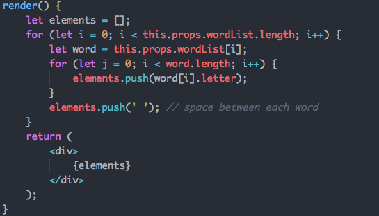
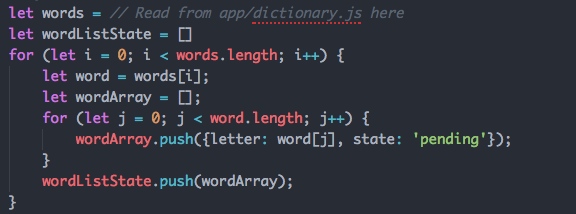
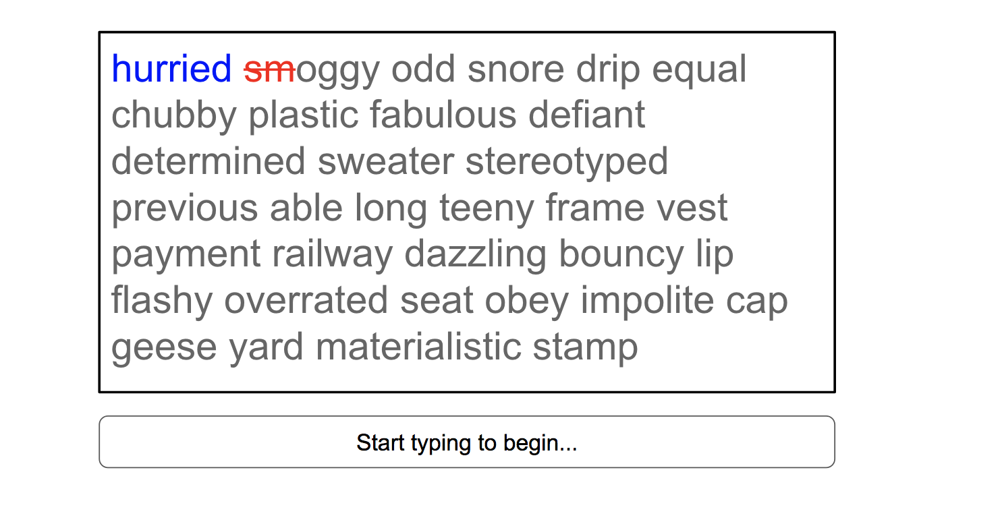
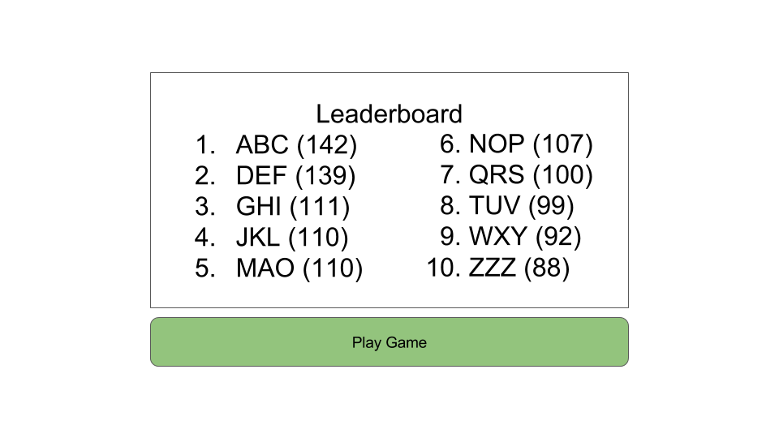

# React/Redux Typing Game
The goal of this exercise is to write a typing game using React/Redux. Feel free to ignore all of these instructions and use the screenshots to guide your way. This folder is a React/Redux template similar to the one you worked on for yesterday's exercises, so you should be familiar with its' structure.

## Part 1: Setup & Start Game

Currently if the user navigates to `index.html` the `app/components/App.js` component is displayed. For Part 1 you will write code to set-up the game and to start the gameplay.


1. Create a new reducer to keep track of your game state in `reducers/gameReducer.js` and add it to `reducers/index.js`
    1. Import words from `app/dictionary.js`
    1. Use [`_.shuffle`](http://underscorejs.org/#shuffle) from the Underscore.js library to randomize the loaded words
    1. Get the first **100 words** from this list and add them to your initial state under `wordList`
1. Edit `containers/GameContainer.js`
    1. Update `mapStateToProps()` and map `wordList` to your props
1. Create a `WordBox` component and add it to `GameContainer`, it will receive
`wordList` via props. Your WordBox component is responsible for rendering a div
containing each word in its `wordList` prop.

    <details><summary>
    Hint
    </summary><p>

    Use `Array.prototype.join()` to put a single space between each word.

    

    </p></details>

1. Put your CSS in `app/index.tpl.html` where it says `YOUR CSS STYLES HERE`

If you need help styling, you can use this [sample CSS/HTML for your `WordBox` component](https://codepen.io/horizons/pen/QgVmmm?editors=1100)

### Goal

When the user first navigates you should now see something similar to the following image.


## Part 2: Highlight Letters & Mistakes

Now let's update our state so we can distinguish between letters that have
been typed correctly and incorrectly. Each character/letter correspond to an
object that has the keys:

- `letter`: This will hold the letter value that should be displayed
- `status`:  This will be either `pending`, `correct`, `incorrect`. Characters in the 'pending' state are those that have not been typed yet and will be displayed in gray. Characters in the 'correct' or 'incorrect' state will be the characters the player has correctly/incorrectly typed and should be highlighted in blue and red respectively.

1. Change your initial state to

    ```javascript
    {
        wordList: [
            [{letter: 'I', status: 'correct'}],
            [
                {letter: 'a', status: 'incorrect'},
                {letter: 'm', status: 'correct'}
            ],
            [
                {letter: 'P', status: 'correct'},
                {letter: 'a', status: 'pending'},
                {letter: 'm', status: 'pending'}
            ]
        ]
    }
    ```

1. This state represents the words `['I', 'am', 'Pam']`. Update your
`WordList` component `render` function to properly handle this state.

    <details><summary>
    Hint
    </summary><p>

    You can use a nested for-loop to display state from nested arrays.

    

    </p></details>
1. Update your CSS so that pending letters are gray, correct letters are
blue and incorrect letters are red.

    You should see:

    
1. Change your initial state to read from `app/dictionary.js` again but this
time automatically convert the word array into properly formatted state
where each letter is replaced with an object that contains the letter and its
status `{letter: 'x', status: 'pending'}`.

    <details><summary>
    Hint
    </summary><p>

    You can use a nested for loop to convert the words array into state.

    

    </p></details>

### Goal

You should now see a box full of words where every letter is gray.

## Part 3: Typing

1. Add the following to our Redux state:
    - `currentIndex` (initially `[0,0]`): an array of 2 numbers that point to our current location in the array in the format `[word #, char #]` - remember that since strings are Arrays in JavaScript we can use Array notation to access characters.
    - `userInput` (initially `''`): a string that controls the contents of the `TextBox` element
1. Create a `TextBox` component that contains an `<input type="text" />` element for input, this should receive its `value` from Redux state `userInput`.
1. Update `GameContainer` and pass `this.onInput()` to `TextBox` as a prop, and use the `onKeyPress` event handler for the `<input type="text">` to call `onInput()` with the new letter that was typed in.

    [Example usage of onKeyPress to control input](https://codepen.io/horizons/pen/RLydVR?editors=0010)

1. Inside `onInput()` do:
    1. __IF__ a new non-whitespace character is entered:
        - Dispatch a `CHAR_ADDED` event with the new character (i.e. letter) that was just typed.

            <details>
            <summary>Hint</summary>
            <div>

            ```javascript
            dispatch({type: 'CHAR_ADDED', letter: 'x'});
            ```

            </div>
            </details>
        - When you receive a `CHAR_ADDED` action in your reducer, compare the
        new letter against our `wordList` at the `currentIndex`.
        Update the `status` of the corresponding letter in the `wordList`
        array to indicate `correct` or `incorrect`.

            You can make a copy of the `wordList` state with this function and
            mutate (i.e. modify) it safely.

            ```javascript
            function cloneWordList(wordList) {
                return wordList.map(word =>
                      word.map(letterObj =>
                          Object.assign({}, letterObj)));
            }
            ```

            <details><summary>
            Hint
            </summary><p>

            Once you copy the word list you can find the object that describes
            the current letter with:

            ```javascript
            wordList[this.currentIndex[0]][this.currentIndex[1]]
            ```

            </p></details>

        - Update `currentIndex` to to move to the **next letter.**
        - Update `userInput` by adding the newly typed letter to the end of the string.
    1. __IF__ a whitespace character is entered:
        - Dispatch a `NEXT_WORD` action.
        - When you receive a `NEXT_WORD` action in your reducer, clear contents of `userInput`.

            Update `currentIndex` to move to the **next word.**

            <details>
            <summary>Hint</summary>
            <div>

            We want to increment the `word #` index and set the `char #` index back to zero.
            Add 1 to `currentIndex[0]` and set `currentIndex[1]` back to zero.

            </div>
            </details>


__Note:__ The user __SHOULD NOT__ be able to press the DELETE/BACKSPACE key to undo mistakes in this game

If you need help styling your application you can use this [sample HTML/CSS for `WordBox` and `TextBox`](https://codepen.io/horizons/pen/Pjdepe?editors=1100)


### Goal

When you start typing, you should see letters correctly typed letters
highlighted in blue and incorrectly typed letters highlighted in red.



### Part 4: Timing

Let's add timing functionality to this game. We need to add a timer that will
begin counting once the user starts typing, and will stop once the game has
ended (once the user has typed all words in the box).

1. Add `timeLeft` to your initial state in your reducer and give it the initial value `60`.
1. Create a `InfoBar` component to display the timer. Have `InfoBar` receive a prop `timeLeft` and display it bellow the `TextBox`.
1. Update `mapDispatchToProps()` and create three actions `START_GAME`, `INCREMENT_TIMER`, and `END_GAME`.
1. Update the `onInput()` function in `GameContainer` with:
    1. Dispatch a `START_GAME` action when the game beings.

        <details><summary>
        Hint
        </summary><p>

        The game begins when the user types in to the textbox for the first time.
        At the beginning of the game `currentIndex` will be `[0, 0]`.

        </p></details>

    1. Use `setInterval` inside `onInput()` to dispatch an `INCREMENT_TIMER` action every 1000ms.

        The `setInterval` should dispatch an `END_GAME` action
        once all the words have been typed.

        Save the id that `setInterval()` returns `this.interval` so you
        can clear it later when the game ends
        (i.e. the timer has run out).

        <details>
        <summary>Hint</summary>

        ```javascript
        this.interval = setInterval(() => {
            //dispatch INCREMENT_TIMER action
            if (time has run out) {
                //dispatch END_GAME action
                clearInterval(this.interval);
            }
        }, 1000);
        ```
        </details>
    1. Handle the `DECREMENT_TIMER`, `START_GAME` and `END_GAME` actions in
    your reducer.

        `DECREMENT_TIMER` should decrease `timeLeft` by 1.

## Goal

When you start typing, you should see the timer change for every second passed.


## Part 5: Scoring
1. Update `InfoBar` component to display the total score (initially 0)
1. Add the following to our state:
    - `totalScore`: # of matching letters - # of mismatching letters
1. Calculate `totalScore`. We already  compare `wordList` and `input` in our `onInput` function in our `GameContainer`.  We are going to want to dispatch an action(s) to either increment or decrement `totalScore` in our state.  We will leave it to you to decide the necessary actions to make these changes.
1. When the game is over, you should either alert the user or display a message saying


## Part 6: Game Over

When the `setInterval` dispatches an `END_GAME` action end the game and display a Game over page. `Game over! Final Time: [time in seconds] Score: [total score]`

<!-- 1. When `END_GAME` is dispatched update `totalScore` by adding `streakCount` and `totalScore` -->
1. Create a `GameOver` container which contains `FinalScore`, `PlayGameButton`, and `ViewLeaderboardButton` components
1. Create a route for this page of your App
1. Display `totalScore` and `timeLeft` in the `FinalScore` component
1. Clicking the `PlayGameButton` should dispatch a `RESTART_GAME` action, which resets the values in state (i.e. set `currentIndex` to `[0,0]`, `totalScore` to `0`, etc...) and navigates you back to the default route where you should see the `GameContainer`
1. Clicking the `ViewLeaderboardButton` navigates you to the route you create in the next part for the Leaderboard

### Goal
Your finished __Game Over!__ page should look something like the following.


## BONUS: Part 7: Leaderboard
If your `totalScore` was in the Top 10, the `END_GAME` action asks you for your 3-character initials and adds you to the Leaderboard. __Note__ you can use `localStorage` to keep track of top 10 user scores (by putting them in an Object like below). Since `localStorage` only works with Strings, you will have to use `JSON.parse` and `JSON.stringify` to store Objects.

```js
{
  "1": {
    "name": "ABC",
    "score": 102
  },
  "2": {
    "name": "DEF",
    "score": 101
  }
}
```

1. When `END_GAME` is dispatched, check if the user's `totalScore` is in the Top 10
1. If __NOT__ in the Top 10 follow instructions in the last Part
1. If user is in the Top 10, point them to a `RegisterContainer` (this contains `InitialsInput` and `SubmitButton` components)
1. When the `SubmitButton` is pressed, add the initials & `totalScore` to localStorage (while also removing the tenth place user if one exists). Then navigate the user to the Leaderboard route
    
1. Create a `Leaderboard` container which has a `Board` component and a `PlayGameButton` component, and also create a corresponding route for the Leaderboard
1. The `Board` component retrieves the Top 10 scores from `localStorage` and displays them - rtrieve in comonent did mount from local storage into state,
1. The `PlayGameButton` fires a `RESTART_GAME` action (whose behavior was described in an earlier part)

### Goal
Your completed leaderboard should look a little something like the following image.




## BONUS: Part 8: Streaks
1. Update `InfoBar` the current streak bonus (all initially 0)
1. Add the following to our state:
    - `streakCount`: the current streak bonus
1. When `END_GAME` is dispatched update `totalScore` by adding `streakCount` and `totalScore`.
1. Modify `RESTART_GAME` action, which now must also reset the `streakCount` in state to 0
1. Change how we calculate `totalScore`. `totalScore`: (# of matching letters + streaks) - # of mismatching letters
1. Calculate `streakCount`.
The streak is the total number of words the player gets correct in a row (1 word = 1 point ; 2 words = 1 + 2 points ; 3 words = 1 + 2 + 3 points...). These points are awarded as bonus _on top of_ the points received for character matching. So for instance if a user correctly matched the words `"horizons is amazing"` they would get a total of `(8+1) + (2+2) + (7+3) = 23` points. The following is an example of a streak. __Note__ that a streak is not added to the total score until a mistake has been made to reset the streak or the game has ended.


## Done!

Congratulations! You've finished the React/Redux typing game. Here are a few bonus features you can implement to make it extra special.

- Keep track of speed (words/min) and create a graph of typing speed over time
- Multiplayer Mode
    - The same set of words are given to each player & the player w/the highest points wins
    - Sudden Death: First player to make a mistake loses
